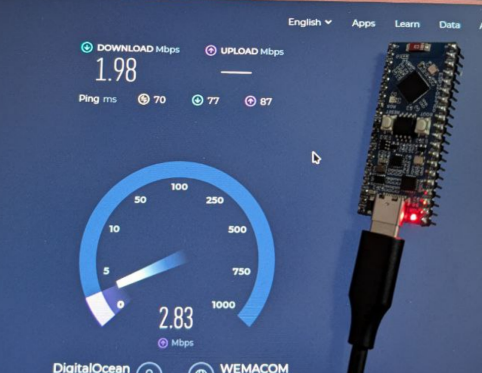

# lamella

> Borrow the ESP32's WiFi - powered by Rust + ergot

**Work in Progress**

Lamella lets a host device use an ESP32's WiFi through a TAP interface. The ESP32 acts as a network bridge, forwarding Ethernet frames between the host and wireless network.



## Architecture

```
┌────────────┐                 ┌─────────┐          ┌──────────┐
│    Host    │◄─── any link ──►│  ESP32  │◄──WiFi──►│ Network  │
│ (esp32tap) │                 │         │          │          │
└────────────┘                 └─────────┘          └──────────┘
```

Transport-agnostic design. Currently supported: USB, Serial.

- **firmware-s3** — ESP32-S3 firmware (tested, works)
- **firmware-c3** — ESP32-C3 firmware (WIP, buggy)
- **host** — daemon that creates a TAP interface and bridges traffic
- **icd** — shared protocol definitions (Interface Control Document)

## Building

Requires Rust 1.85+ (2024 edition).

```bash
# Host daemon
cargo build -p host --release

# Firmware
cd firmware-s3  # requires esp toolchain (Xtensa)
cargo build --release

cd firmware-c3  # standard Rust (RISC-V)
cargo build --release
```

## Usage

```bash
sudo ./target/release/host nusb
# or
sudo ./target/release/host serial --port /dev/ttyACM0
```

## Dependencies

Built on [ergot](https://github.com/jamesmunns/ergot) — a transport-agnostic messaging library that runs on everything from PCs to tiny `no_std` microcontrollers. Provides type-safe sockets, addressing, and routing.

## License

MIT OR Apache-2.0
