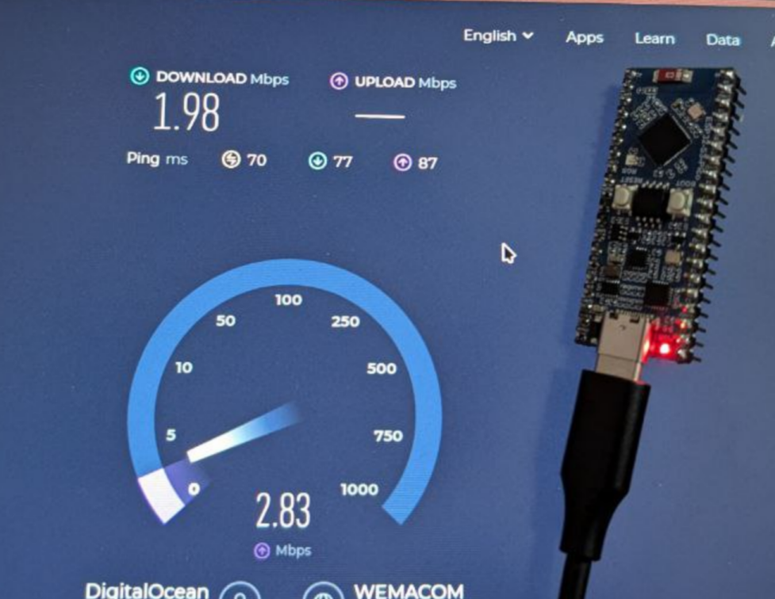

# lamella

> Borrow the ESP32's WiFi - powered by Rust + ergot

**Status: ready for use on ESP32-C3 and ESP32-S3.**

Lamella lets a Linux host use an ESP32's WiFi through a TAP interface. The ESP32 acts as a network bridge, forwarding Ethernet frames between the host and the wireless network.



## Architecture

```
┌────────────┐                 ┌─────────┐          ┌──────────┐
│    Host    │◄─── any link ──►│  ESP32  │◄──WiFi──►│ Network  │
│ (esp32tap) │                 │         │          │          │
└────────────┘                 └─────────┘          └──────────┘
```

The bridge is transport-agnostic. The currently supported hardware and transports are:

- **firmware-s3** — ESP32-S3 over USB OTG bulk transfers
- **firmware-c3** — ESP32-C3 over its built-in USB Serial/JTAG peripheral
- **host** — Linux daemon that creates a TAP interface and bridges traffic
- **icd** — shared protocol definitions (Interface Control Document)

Both firmware targets have been tested on hardware. The ESP32-C3 has additionally passed sustained bidirectional and end-to-end WiFi testing; its USB Serial/JTAG investigation and A/B results are documented in [docs/usb-serial-jtag-ab-testing.md](docs/usb-serial-jtag-ab-testing.md).

## Requirements

- Linux with TAP/TUN support and `ip` from iproute2
- Rust 1.95 or newer
- `CAP_NET_ADMIN` or root privileges when running the host daemon
- the Rust RISC-V target and `probe-rs` for ESP32-C3
- the Espressif Rust toolchain and `espflash` for ESP32-S3

WiFi credentials are compiled into the firmware through the `WIFI_SSID` and `WIFI_PASSWORD` environment variables.

## Building

```bash
# Host daemon
cargo build -p host --release

# ESP32-C3 firmware (RISC-V)
cd firmware-c3
WIFI_SSID='<ssid>' WIFI_PASSWORD='<password>' \
  cargo build --release --bin firmware-c3

# ESP32-S3 firmware (Xtensa)
cd ../firmware-s3
WIFI_SSID='<ssid>' WIFI_PASSWORD='<password>' \
  cargo +esp build --release --bin firmware
```

The firmware directories are separate Cargo workspaces because they use different embedded targets and toolchains. Their configured runners can build and flash in one step by replacing `cargo build` with `cargo run` (and `cargo +esp build` with `cargo +esp run`).

## Usage

```bash
# ESP32-S3 over USB OTG
sudo ./target/release/host nusb

# ESP32-C3 over USB Serial/JTAG
sudo ./target/release/host serial --port /dev/ttyACM0

# ESP32-C3 with hot-plug support
sudo ./target/release/host serial --by-id Espressif_USB_JTAG
```

Run `./target/release/host --help` for test-mode and transport options. The daemon creates an `esp32tap` interface and shuts down cleanly on Ctrl-C.

## Dependencies

Built on [ergot](https://github.com/jamesmunns/ergot) — a transport-agnostic messaging library that runs on everything from PCs to tiny `no_std` microcontrollers. Provides type-safe sockets, addressing, and routing.

## License

MIT OR Apache-2.0
